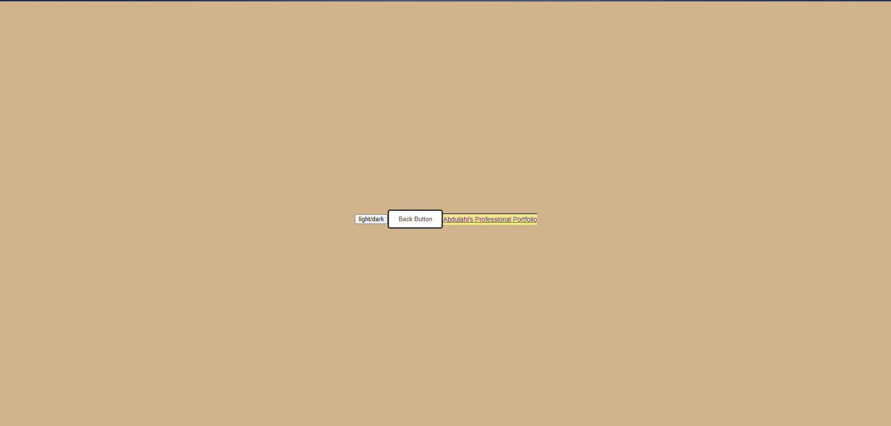

# MARKETING PERSONAL BLOG
## Description
This is a assignment for school showcasing skills learned in HTML, CSS, JavaScript and Web APIs. I am tasked to use these skills to create a two page blog which includes local storage for the data to be input, a light/dark mode toggle button, a back button and more.

## Link to Deployed Applications
[Link](https://a293moha.github.io/marketing-personal-blog/)

[GitHub](https://github.com/a293moha/marketing-personal-blog)

## Screenshot

